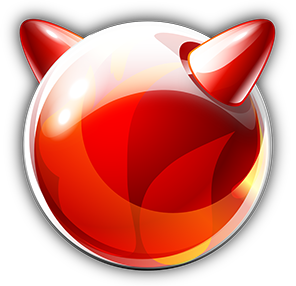
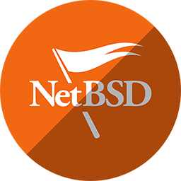

# 
Awesome-BSD-PPP

***********

***********

###### 
Port, Programs, and Projects! 

This repository will function as a list of interesting ports, programs, and Projects for newbies and veterans to BSD.

**Acknowledgements**:
I am merely a passionate newbie to these OS's and freely admit that I know enough to be dangerous, please put in a pull request if you find information that can be improved or otherwise modified to be clearer.

## Table of Contents

- [Frequenty Asked Questions](#FAQ)
  - [What is BSD?](#What-is-BSD)
  - [How is BSD different than Linux?](#How-is-BSD-different-than-Linux)
  - [What are the differences between Packages and Ports?](#What-are-the-differences-between-Packages-and-Ports)
  - [Can I mix and Match Ports and Packages?](#Can-I-mix-and-Match-Ports-and-Packages)
  - [What if I have another BSD?](#What-if-I-have-another-BSD)
  - [How can I install these programs?](#How-can-I-install-these-programs)
  - [What are the Big Four BSD's?](#What-are-the-Big-Four-BSD's)
- [Icon Key](#Key)
- [Ports and Programs](#Ports-and-Programs)
  - [Audio](#Audio)
  - [Command Line Utilities](#Command-Line-Utilities)
  - [Chat Clients](#Chat-Clients)
  - [Data Backup and Recovery](#Data-Backup-and-Recovery)
  - [Desktop Environments](#Desktop-Environments)
  - [Development](#Development)
  - [Editors](#Editors)
  - [Emulators](#Emulators)
  - [File Managers](#File-Managers)
  - [Network Tools](#Network-Tools)
  - [Office](#Office)
  - [Security](#Security)
  - [Terminal Emulators](#Terminal-Emulators)
  - [UNIX Shells](#UNIX-Shells)
  - [Utilities](#Utilities)
- [Miscallaneous BSDs](#Miscallaneous-BSDs)
- [Projects](#Projects)
- [How-To's](#How-To's)
- [Miscallaneous Web Sources](#Miscallaneous-Web-Sources)
  - [BSD Handbooks](#BSD-Handbooks)
- [Other Awesome Lists](#Other-Awesome-Lists)
- [Attribution](#Attribution)

## FAQ

#### What is BSD?

![Awesome][UNIX tree]

BSD was originally a UNIX based operating system that was developed at the the University of Berkeley in California in the late 70's. At the time it was a closed source, or partially closed source operating system that was gradually re-engineered into a completely Open source Operating System now used all over the world.

#### How is BSD different than Linux?

BSD takes a more centralized approach in its development having entire program and kernel ecosystems developed together. Whereas Linux itself is just a kernel which then requires groups of people to add packages and other system components together to build the whole operating system, this creates a Linux "Distribution" a distribution of software components (programs, Kernel, drivers and whatnot.)

Because of this difference and because BSD is built around an entire ecosystem from the start, it has an excellent history of documentation for its various functions, both in the Kernel, and with its programs.

For the average UNIX user, it will seem very familiar in many ways, and learning BSD from Linux or other UNIX based Operating Systems will be fairly straightforward, with nearly all of the most common UNIX friendly tools and shells are available for the user.

#### What are the differences between Packages and Ports?

A ***Package*** (Referred to as a program in this list) is a program already compiled into a binary that can be run on the largest number of systems due to be pre-compiled for you with the most general settings. It requires only the briefest installation, and does not require compilation to run on your machine.

A ***Port*** is source code with instructions that allow you to compile the code on your machine to create an executable program. It has the advantage of allowing you to compile the program in a more specific way for your machine to get extra performance from the code or only get parts of the program that you need such as only getting the webhost part of an Apache webserver, but no WebDAV or support for User Directories making the program smaller and leaner.

BSD allows installation of both types of software to allow for either ease or flexibility in your OS and environment, it is up to you to decide which you would prefer to use.

#### Can I mix and Match Ports and Packages?

If you know what you are doing, there should be little issue, Issues come when you don't know.

A basic scenario would be this: say you would like to install only part of a webserver, and you modify the port make file to ensure you only install that part. It will function normally, but if you install a program that requires that as a dependency, it may see it, but malfunction due to not having the entirely of that program installed. If the software have no relation to each other, there should be no issues. But when in doubt, install either only ports, or only Packages.

#### What if I have another BSD?

If you use MidnightBSD, NomadBSD or GhostBSD, or any of a variety of alternative BSD's, typically they are based off one of the main 4 BSD's: DragonflyBSD, FreeBSD, NetBSD, or OpenBSD and will have access to their ports. A brief perusal of the BSD's home website will generally inform you of which you can use. Simply click on the BSD that yours is based on here and follow the same instructions.

Debian GNU/kFreeBSD does not have a port system, and instead uses the Debian Packaging that Debian Linux uses.

#### How can I install these programs?

It depends on the BSD but they all will be somewhat similar, this will assume that you have the OS setup and are sitting at a command line. These will nearly always have to be run as the super user or root. (Using the doas or sudo commands.)

**DragonflyBSD**: pkg install (*packagename*)

**FreeBSD**: pkg install (*packagename*)

**NetBSD**: pkgin install (*packagename*)
  ^*Note that NetBSD may need to have [pkgin installed](https://pkgin.net/) first before this command will function.*
  ^^*Additional Note You may need to follow [these instructions](https://www.pkgsrc.org/wip/) if the pkg is located in wip.

**OpenBSD**: pkg_add (*packagename*)

#### What are the Big Four BSD's?

Currently there are 4 BSD projects seen as the largest among the BSD's and are the various icons listed here, for those who are not familiar with one, in alphabetical order here are some basic descriptions of them:

# [DragonflyBSD](https://www.dragonflybsd.org/)

DragonFly belongs to the same class of operating systems as other BSD-derived systems and Linux. It is based on the same UNIX ideals and APIs and shares ancestor code with other BSD operating systems. DragonFly provides an opportunity for the BSD base to grow in an entirely different direction from the one taken in the FreeBSD, NetBSD, and OpenBSD series.

# [FreeBSD](https://www.freebsd.org/)

FreeBSD is an operating system used to power modern servers, desktops, and embedded platforms. A large community has continually developed it for more than thirty years. Its advanced networking, security, and storage features have made FreeBSD the platform of choice for many of the busiest web sites and most pervasive embedded networking and storage devices.

# [NetBSD](https://www.netbsd.org/)

NetBSD is a free, fast, secure, and highly portable Unix-like Open Source operating system. It is available for a wide range of platforms, from large-scale servers and powerful desktop systems to handheld and embedded devices.

# [OpenBSD](https://www.openbsd.org/)

The OpenBSD project produces a FREE, multi-platform 4.4BSD-based UNIX-like operating system. Our efforts emphasize portability, standardization, correctness, proactive security and integrated cryptography. As an example of the effect OpenBSD has, the popular OpenSSH software comes from OpenBSD.

***********

## Key
   = is available in the FreeBSD Ports, and provides a link to that port.

   = is available in the NetBSD Ports, and provides a link to that port.

   = is available in the DragonflyBSD Ports, and provides a link to that port.

   = is available in the OpenBSD Ports, and provides a link to that port.

   = Program is Command line only.

  ![Open-Source Software][OSS Icon] = Program is open source, and is freely available, source code and all. if you click this icon, it will take you to that source code for that program.

  ![Closed-Source Software][Money Icon] = Program is closed source, and may cost money.

***********

## Ports and Programs

### Audio

- [![Open-Source Software][OSS Icon]](https://github.com/audacity/audacity) [Audacity](http://www.audacityteam.org/) - Free, open source, cross-platform software for recording and editing sounds.

     

- [![Open-Source Software][OSS Icon]](https://github.com/clementine-player/Clementine) [Clementine](https://www.clementine-player.org/) - Clementine is a multiplatform music player. It is inspired by Amarok 1.4, focusing on a fast and easy-to-use interface for searching and playing your music.

     

### Command Line Utilities

- [![Open-Source Software][OSS Icon]](https://sourceforge.net/projects/anacron/) [Anacron](https://sourceforge.net/projects/anacron/) - Anacron is a periodic command scheduler. It executes commands at intervals specified in days. Unlike cron, it does not assume that the system is running continuously. It can therefore be used to control the execution of daily, weekly and monthly jobs (or anything with a period of n days), on systems that don't run 24 hours a day. When installed and configured properly, Anacron will make sure that the commands are run at the specified intervals as closely as machine-uptime permits.

      

- [![Open-Source Software][OSS Icon]](https://github.com/athityakumar/colorls) [Colorls](https://github.com/athityakumar/colorls) - A Ruby gem that beautifies the terminal's ls command, with color and font-awesome icons. 🎉

     

- [![Open-Source Software][OSS Icon]](http://mama.indstate.edu/users/ice/tree/) [Colortree](http://mama.indstate.edu/users/ice/tree/) - Tree is a recursive directory listing command that produces a depth indented listing of files, which is colorized ala dircolors if the LS_COLORS environment variable is set and output is to tty. Tree has been ported and reported to work under the following operating systems: Linux, FreeBSD, OS X, Solaris, HP/UX, Cygwin, HP Nonstop and OS/2.

   

- [![Open-Source Software][OSS Icon]](https://github.com/ogham/exa) [Exa](https://the.exa.website/) - exa is an improved file lister with more features and better defaults. It uses colours to distinguish file types and metadata. It knows about symlinks, extended attributes, and Git. And it’s small, fast, and just one single binary.

      

- [![Open-Source Software][OSS Icon]](https://github.com/dylanaraps/neofetch) [Neofetch](https://github.com/dylanaraps/neofetch) - Neofetch is a command-line system information tool written in bash 3.2+. Neofetch displays information about your operating system, software and hardware in an aesthetic and visually pleasing way.

      

### Chat Clients

#### 3rd party Client

- [![Open-Source Software][OSS Icon]](https://github.com/Bios-Marcel/cordless) [Cordless](https://github.com/Bios-Marcel/cordless) - Cordless is a custom Discord client that aims to have a low memory footprint and be aimed at power-users. It uses a TUI interface on the command line - The Discord terminal client you never knew you wanted.

    

- [![Open-Source Software][OSS Icon]](https://github.com/Aseman-Land/Cutegram) [Cutegram](https://aseman.co/) - Cutegram is a free and open source telegram clients for Linux, Windows, OS X and OpenBSD, focusing on user friendly, compatibility with desktop environments. Cutegram using Qt5, QML, libqtelegram, libappindication, AsemanQtTools technologies and Faenza icons and Twitter emojies graphic sets. It’s free and released under GPLv3 license.

  

#### All-in-One Client

- [![Open-Source Software][OSS Icon]](https://keep.imfreedom.org/pidgin/) [Finch](https://developer.pidgin.im/wiki/Using%20Finch) - Finch is the Command line interface for [Pidgin](https://www.pidgin.im/), Finch is a multi-protocol instant messaging client. It is compatible with AIM (Oscar and TOC protocols), ICQ, IRC, Jabber, Gadu-Gadu, and Zephyr networks.

     

- [![Open-Source Software][OSS Icon]](https://keep.imfreedom.org/pidgin/) [Pidgin](https://www.pidgin.im/) - Pidgin is a chat program which lets you log into accounts on multiple chat networks simultaneously. This means that you can be chatting with friends on XMPP and sitting in an IRC channel at the same time.

     

#### Chat Server

- [![Open-Source Software][OSS Icon]](https://github.com/ircd-hybrid/ircd-hybrid) [IRCD-Hybrid](https://www.ircd-hybrid.org/) - IRC (Internet Relay Chat) provides a way of communicating in real time with people. Generally, the user runs a client program to a server running a IRC server software. Hybrid ircd is such a server.

      

- [![Open-Source Software][OSS Icon]](https://github.com/mattermost/mattermost-server) [Mattermost-Server](https://mattermost.com/) - Open source Slack-alternative in Golang and React.

      

- [![Open-Source Software][OSS Icon]](https://github.com/ngircd/ngircd) [ngIRCd](https://ngircd.barton.de/) - ngIRCd is a free, portable and lightweight Internet Relay Chat server for small or private networks, developed under the GNU General Public License (GPL). The server is quite easy to configure, can handle dynamic IP addresses, and optionally supports IDENT, IPv6 connections, SSL-protected links, and PAM for user authentication as well as character set conversion for legacy clients. The server has been written from scratch and is not based on the forefather, the daemon of the IRCNet.

      

- [![Open-Source Software][OSS Icon]](https://github.com/oragono/oragono) [Oragono](https://oragono.io/) - Oragono is a modern IRC server written in Go. Its core design principles are: ,Being simple to set up and use, Combining the features of an ircd, a services framework, and a, bouncer (integrated account management, history storage, and bouncer functionality), Bleeding-edge IRCv3 support, suitable for use as an IRCv3 reference implementation, Highly customizable via a rehashable (i.e., reloadable at runtime) YAML config.

    

#### Chat Server Utilities

- [![Open-Source Software][OSS Icon]](https://github.com/bitlbee/bitlbee) [BitlBee](https://www.bitlbee.org/main.php/news.r.html) - BitlBee brings IM (instant messaging) to IRC clients. It's a great solution for people who have an IRC client running all the time and don't want to run an additional XMPP/facebook/discord/whatever client.

      

- [![Open-Source Software][OSS Icon]](https://github.com/42wim/matterbridge) [Matterbridge](https://github.com/42wim/matterbridge) - bridge between mattermost, IRC, gitter, xmpp, slack, discord, telegram, rocketchat, steam, twitch, ssh-chat, zulip, whatsapp, keybase, matrix, microsoft teams, nextcloud, mumble and more with REST API (mattermost not required!)

    

#### IRC Client

- [![Open-Source Software][OSS Icon]](https://github.com/hexchat/hexchat) [EPIC](https://hexchat.github.io/) - EPIC is a IRC client that has been under active development for 25+ years in 5 generations. It is stable and mature, and offers an excellent ircII interface for those of us who are accustomed to the ircII way of doing things.

      

- [![Open-Source Software][OSS Icon]](https://github.com/hexchat/hexchat) [Hexchat](https://hexchat.github.io/) - HexChat is an IRC client based on XChat, but unlike XChat it’s completely free for both Windows and Unix-like systems. Since XChat is open source, it’s perfectly legal. For more info, please read the Shareware background.

     

- [![Open-Source Software][OSS Icon]](https://github.com/mbp/lostirc/tree/master/lostirc) [LostIRC](http://lostirc.sourceforge.net/) - LostIRC is a simple, yet very useful IRC client. It has features such as tab-autocompletion, multiple server support, automatic joining of servers/channels, logging and DCC sending which should cover the needs of most people. Another goal that the application has in mind, is 100% keyboard controlability. It was written using the gtkmm GUI library.

   

- [![Open-Source Software][OSS Icon]](https://github.com/KDE/konversation) [Konversation](https://konversation.kde.org/) - Konversation is a user-friendly Internet Relay Chat (IRC) client built on the KDE Platform.

     

- [![Open-Source Software][OSS Icon]](https://github.com/weechat/weechat) [Weechat](https://weechat.org/) - Full-featured IRC chat client with plugin support for: multi-servers, proxy support, IPv6, SASL authentication, nicklist, DCC, and many other features.

     

#### XMPP/Jabber Chat Client

- [![Open-Source Software][OSS Icon]](https://github.com/dino/dino) [dino](https://dino.im/) - Dino is a modern open-source chat client for the desktop. It focuses on providing a clean and reliable Jabber/XMPP experience while having your privacy in mind.

     

### Data Backup and Recovery

- [![Open-Source Software][OSS Icon]](https://www.bacula.org/git/cgit.cgi/bacula/) [Bacula - Client](https://www.bacula.org/) - Bacula is a set of Open Source, computer programs that permit you to manage backup, recovery, and verification of computer data across a network of computers of different kinds. This is for the client installation.

     

- [![Open-Source Software][OSS Icon]](https://www.bacula.org/git/cgit.cgi/bacula/) [Bacula - Server](https://www.bacula.org/) - Bacula is a set of Open Source, computer programs that permit you to manage backup, recovery, and verification of computer data across a network of computers of different kinds. This is for the server installation.

    

- [![Open-Source Software][OSS Icon]](https://github.com/borgbackup/borg) [BorgBackup](https://borgbackup.readthedocs.io/en/stable/) - BorgBackup (short: Borg) is a deduplicating backup program. Optionally, it supports compression and authenticated encryption. The main goal of Borg is to provide an efficient and secure way to backup data. The data deduplication technique used makes Borg suitable for daily backups since only changes are stored. The authenticated encryption technique makes it suitable for backups to not fully trusted targets.

      

- [![Open-Source Software][OSS Icon]](https://github.com/backuppc/backuppc) [BackupPC](https://backuppc.github.io/backuppc/) - BackupPC is a high-performance, enterprise-grade system for backing up Linux, Windows and macOS PCs and laptops to a server's disk. BackupPC is highly configurable and easy to install and maintain.

      

### Desktop Environments

- [![Open-Source Software][OSS Icon]](https://gitlab.gnome.org/GNOME/gnome-shell) [Gnome 3](https://www.gnome.org/gnome-3/) - GNOME 3 provides a focused working environment that helps you to get things done, and it is packed with features that will make you more productive. A powerful search feature lets you access all your work from one place. Side-by-side windows makes it easy to view several documents at the same time.

     

- [![Open-Source Software][OSS Icon]](https://github.com/KDE) [KDE](https://kde.org/) - K Desktop Environment (KDE) is an Open Source graphical desktop environment for UNIX workstations. Initially called the Kool Desktop Environment it includes a file manager, a window manager, a help system, a configuration system, tools and utilities, and several applications.

     

- [![Open-Source Software][OSS Icon]](https://github.com/lumina-desktop/lumina) [Lumina](https://lumina-desktop.org/) - The Lumina desktop is designed to be fast, customizable, flexible, and lightweight. Lumina works great in multi-monitor configurations and with high-resolution monitors as well as single-screen configurations on laptops or tablets.

     

### Development

#### C\+\+

- [![Open-Source Software][OSS Icon]](http://www.codeblocks.org/downloads/source) [Code::Blocks](http://www.codeblocks.org/) - Code::Blocks is a free C, C++ and Fortran IDE built to meet the most demanding needs of its users. It is designed to be very extensible and fully configurable.

   

#### General Purpose IDE's

- [![Open-Source Software][OSS Icon]](https://github.com/geany/geany) [Geany](https://www.geany.org/) - Geany is a powerful, stable and lightweight programmer's text editor that provides tons of useful features without bogging down your workflow. It runs on Linux, Windows and MacOS is translated into over 40 languages, and has built-in support for more than 50 programming languages.

     

- [![Open-Source Software][OSS Icon]](https://github.com/microsoft/vscode) [Visual Studio Code](https://code.visualstudio.com/) - VS Code is a type of tool that combines the simplicity of a code editor with what developers need for their core edit-build-debug cycle. It provides comprehensive editing and debugging support, an extensibility model, and lightweight integration with existing tools.

  

### Editors

- [![Open-Source Software][OSS Icon]](https://github.com/atom/atom) [Atom](https://atom.io/) - Atom is a free and open-source text and source code editor for macOS, Linux, and Microsoft Windows with support for plug-ins written in Node.js, and embedded Git Control, developed by GitHub.

  

  - [![Open-Source Software][OSS Icon]](https://github.com/facebookarchive/atom-ide-ui) [Atom-ide](https://ide.atom.io/) - Atom UIs to support language services and debuggers as part of Atom IDE. Installable on any Atom installation as a plugin. 
 

- [![Open-Source Software][OSS Icon]](https://github.com/emacs-mirror/emacs) [Emacs](https://www.gnu.org/software/emacs/) - An extensible, customizable, free/libre text editor, at its core is an interpreter for Emacs Lisp, a dialect of the Lisp programming language with extensions to support text editing.

      

- [![Open-Source Software][OSS Icon]](https://github.com/tsujan/FeatherPad) [Featherpad](https://github.com/tsujan/FeatherPad) - FeatherPad is a lightweight Qt5 plain-text editor. It is independent of any desktop environment and has: Drag-and-drop support, including tab detachment and attachment, Instant highlighting of found matches when searching, A docked window for text replacement and much more.

     

- [![Open-Source Software][OSS Icon]](https://github.com/mawww/kakoune) [Kakoune](http://kakoune.org/) - Modal editor · Faster as in less keystrokes · Multiple selections · Orthogonal design

      

- [![Open-Source Software][OSS Icon]](http://tarot.freeshell.org/leafpad/) [Leafpad](http://tarot.freeshell.org/leafpad/) - Leafpad is a simple GTK+ text editor that emphasizes simplicity. As development focuses on keeping weight down to a minimum, only the most essential features are implemented in the editor. Leafpad is simple to use, is easily compiled, requires few libraries, and starts up quickly.

     

- [![Open-Source Software][OSS Icon]](https://github.com/zyedidia/micro) [Micro](https://micro-editor.github.io/) - Micro is a terminal-based text editor that aims to be easy to use and intuitive, while also taking advantage of the full capabilities of modern terminals.

      

- [![Open-Source Software][OSS Icon]](https://git.savannah.gnu.org/cgit/nano.git/log/) [Nano](https://www.nano-editor.org/) -nano is a small, free and friendly editor which aims to replace Pico, the default editor included in the non-free Pine package. Rather than just copying Pico's look and feel, nano also implements some missing (or disabled by default) features in Pico, such as "search and replace" and "goto line number".

      

- [![Open-Source Software][OSS Icon]](https://github.com/neovim/neovim) [Neovim](https://neovim.io/) - Neovim is an aggressive refactor of editors/vim. It represents a including sensible defaults, a built-in terminal emulator, asynchronous plugin architecture, and powerful APIs designed for speed and extensibility. It retains full compatibility with almost all Vim plugins and scripts. Open the software with `nvim`, not `neovim`.

      

- [![Open-Source Software][OSS Icon]](https://github.com/syl20bnr/spacemacs#emacs) [Spacemacs](https://github.com/syl20bnr/spacemacs) - A community-driven Emacs distribution
The best editor is neither Emacs nor Vim, it's Emacs and Vim!

  

- [![Open-Source Software][OSS Icon]](https://github.com/vim/vim) [Vim](https://www.vim.org/) - Vim is a highly configurable text editor built to make creating and changing any kind of text very efficient. It is included as "vi" with most UNIX systems and with Apple OS X.

      

### Emulators

- [![Open-Source Software][OSS Icon]](https://www.dosbox.com/wiki/SVN_Builds) [Dosbox](https://www.dosbox.com/) - DOSBox is a DOS-emulator that uses the SDL-library which makes DOSBox very easy to port to different platforms. DOSBox has already been ported to many different platforms, such as Windows, BeOS, Linux, and MacOS.

      

### File Managers

- [![Open-Source Software][OSS Icon]](https://github.com/jarun/nnn) [nnn](https://github.com/jarun/nnn) - nnn is a fast and resource-sensitive file browser which integrates well with your DE and favorite GUI utilities, works with the desktop opener, supports bookmarks, has smart navigation shortcuts, has navigate-as-you-type mode, disk usage analyzer mode, comprehensive file details and much more.

      

- [![Open-Source Software][OSS Icon]](https://github.com/ranger/ranger) [ranger](https://ranger.github.io/) - ranger is a file manager with VI key bindings. It provides a minimalistic yet nice curses interface with a view on the directory hierarchy. The secondary task of ranger is to psychically guess which program you want to use for opening particular files.

      

### Network tools

- [![Open-Source Software][OSS Icon]](https://github.com/fish-shell/fish-shell) [Mosh](https://fishshell.com/) - Mosh is a shell designed to withstand intermittant connectivity between two terminals, functioning similarly to ssh

       

### Office

- [![Open-Source Software][OSS Icon]](https://github.com/KDE/calligra) [Calligra](https://calligra.org/) - Calligra Suite is an office and graphic art suite by KDE. It is available for desktop PCs, tablet computers, and smartphones. It contains applications for word processing, spreadsheets, presentation, vector graphics, and editing databases.

   

- [![Open-Source Software][OSS Icon]](https://gerrit.libreoffice.org/) [Libreoffice](https://www.libreoffice.org/) - LibreOffice is a free and powerful office suite, and a successor to OpenOffice .org (commonly known as OpenOffice). Its clean interface and feature-rich tools help you unleash your creativity and enhance your productivity.

     

- [![Open-Source Software][OSS Icon]](https://sourceforge.net/projects/projectlibre/) [ProjectLibre](https://www.projectlibre.com/product/1-alternative-microsoft-project-open-source) - ProjectLibre is an open source project management software. It intends to be a complete desktop replacement for Microsoft Project. ProjectLibre offers full compatibility with Microsoft Project 2010.

     

### Security

- [![Open-Source Software][OSS Icon]](https://github.com/BastilleBSD/bastille) [Bastille](https://bastillebsd.org/) - Bastille is an open-source system for automating deployment and management of containerized applications on FreeBSD.

   

- [![Open-Source Software][OSS Icon]](https://cvsweb.openbsd.org/cgi-bin/cvsweb/src/usr.bin/doas/) [Doas](https://cvsweb.openbsd.org/cgi-bin/cvsweb/src/usr.bin/doas/) - Native to OpenBSD, Doas is a program that replaces the functionality of sudo, allowing a user to do actions as the root user without logging in as the root user. It has a very simple configuration file and multiple modes.

     

- [![Open-Source Software][OSS Icon]](https://github.com/fail2ban/fail2ban) [Fail2ban](https://www.fail2ban.org/wiki/index.php/Main_Page) - Fail2Ban scans log files like /var/log/auth.log and bans IP addresses conducting too many failed login attempts. It does this by updating system firewall rules to reject new connections from those IP addresses, for a configurable amount of time. Fail2Ban comes out-of-the-box ready to read many standard log files, such as those for sshd and Apache, and is easily configured to read any log file of your choosing, for any error you wish.

     

- [![Open-Source Software][OSS Icon]](https://github.com/future-architect/vuls) [Vuls](https://vuls.io/) - Vuls is open-source, agent-less vulnerability scanner based on information from NVD, OVAL, etc.

  

### Terminal Emulators

- [![Open-Source Software][OSS Icon]](https://github.com/alacritty/alacritty) [Alacritty](https://github.com/alacritty/alacritty) - Alacritty is the fastest terminal emulator in existence. Using the GPU for rendering enables optimizations that simply aren't possible without it. Alacritty currently supports macOS, Linux, BSD, and Windows.

    

### UNIX Shells

- [![Open-Source Software][OSS Icon]](https://savannah.gnu.org/projects/bash/) [Bash](https://www.gnu.org/software/bash/) - The GNU Bourne-Again SHell or bash shell, is typically the default shell available on Linux distributions is available for BSD also, it supports advanced scripting features and is very extensible. Highly reccomended for people trying BSD to ease transition into the OS.

      

  - [![Open-Source Software][OSS Icon]](https://github.com/ohmybash/oh-my-bash) [Oh-My-Bash](https://ohmybash.nntoan.com/) - Oh My Zsh is an open source, community-driven framework for managing your zsh configuration. Can be installed via git or shellscript if not in Ports.

    
 

- [![Open-Source Software][OSS Icon]](https://github.com/tcsh-org/tcsh) [csh](https://www.tcsh.org/) - The C Shell or csh is the default Shell in NetBSD and OpenBSD, It was written by Bill Joy in the late 70's and is one of the oldest continuously developed shells. Development has transferred entirely to tcsh.

   

- [![Open-Source Software][OSS Icon]](https://github.com/elves/elvish) [Elvish](https://elv.sh/) - Elvish is a friendly interactive shell and an expressive programming language. It runs on Linux, BSDs, macOS and Windows. Despite its pre-1.0 status, it is already suitable for most daily interactive use.

     

- [![Open-Source Software][OSS Icon]](https://github.com/fish-shell/fish-shell) [Fish](https://fishshell.com/) - Fish is a shell designed with user friendliness in mind, having many included features such as syntax highlighting and autosuggestions, with extensive tab autocompletion, it is a very interesting take on a POSIX shell.

       

  - [![Open-Source Software][OSS Icon]](https://github.com/oh-my-fish/oh-my-fish) [Oh-My-Fish](https://github.com/oh-my-fish/oh-my-fish) - Oh My Fish is an open source, framework which allows for the installation of plugins that extend the functionality of fish. Can be installed via git or shellscript.

    
 

- [![Open-Source Software][OSS Icon]](https://github.com/tcsh-org/tcsh) [tcsh](https://www.tcsh.org/) - tcsh is the continuation and successor to csh and expands on its functionalities and capabilities. It is the default root shell on FreeBSD though not its default user shell, and can be installed on the other major BSD's.

        

- [![Open-Source Software][OSS Icon]](http://zsh.sourceforge.net/Arc/source.html) [Zsh](http://zsh.sourceforge.net/) - Zsh is an extension of the Bourne Shell (bsh) and includes many improvements such as autocorrect, autocompletion, and is extensible with a great deal of many features. Theming is very popular with Zsh. It is the Default Shell on MacOS.

      

  - [![Open-Source Software][OSS Icon]](https://github.com/ohmyzsh/ohmyzsh/) [Oh-My-Zsh](https://ohmyz.sh/) - Oh My Zsh is an open source, community-driven framework for managing your zsh configuration and themes. Can be installed via git or shellscript if not in Ports. The original oh-my-framework.

     
 

### Utilities

- [![Open-Source Software][OSS Icon]](https://github.com/bleachbit/bleachbit) [Bleachbit](https://www.bleachbit.org/) - Zsh is an extension of the Bourne Shell (bsh) and includes many improvements such as autocorrect, autocompletion, and is extensible with a great deal of many features. Theming is very popular with Zsh. It is the Default Shell on MacOS.

   

***********

## Miscallaneous BSDs
*Here are the various other smaller BSD's that exist, some are for very specific purposes, but there are many BSD's.*

- [BlackBSD](http://blackbsd.tk/) - Based off of NetBSD BlackBSD is a penetration testing distribution with many common pen-testing applications pre-installed. It functions completely as a liveCD or USB.
- [GhostBSD](https://ghostbsd.org/) - A BSD based on FreeBSD it is Designed around the MATE desktop Environment or the XFCE desktop environment, Attempting to be simple, complete, and welcoming.
- [OPNsense](https://opnsense.org/) - A BSD that functions as a Firewall for a home network, or Enterprise, one of the successors to m0n0wall.
- [pfsense](https://www.pfsense.org/)- A BSD that functions as a firewall for a home or enterprise network, one of the successors to m0n0wall.
- [MidnightBSD](https://www.midnightbsd.org/) - A BSD designed for the average desktop user with both Lumina and GNOME 3 desktops available and all the basic software the average user would need.
- [TrueNAS](https://www.truenas.com/) - A BSD based off of FreeBSD focussing on providing the best Fileserver experience for both at home, and in the enterprise.
- [XigmaNAS](https://www.xigmanas.com/) - A BSD based off of FreeBSD which focuses on turning your computer into a Network Attached Storage Appliance.

***********

## Projects

*Links here are some projects that use the BSD OS in some capacity, Firewalls, Webservers, Gameservers, you name it! Just to give you an idea of what you can do with the OS!*

**FreeBSD:**
- [How to setup a Minecraft server on FreeBSD](https://freebsdfoundation.org/freebsd-project/resources/easy-minecraft-server-on-freebsd/)
  - [How to make it autostart whenever FreeBSD boots](https://minecraft.gamepedia.com/Tutorials/FreeBSD_startup_script)
- [Alternative setup for Minecraft on BSD with TMUX and Java installation](https://virtualisationworks.wordpress.com/2017/02/02/minecraft-with-java-and-tmux-on-freebsd/)
- [How to customize the FreeBSD Kernel](https://www.nxfury.com/the-power-to-serve-custom-kernel-goodness-on-freebsd)
- [How to Setup a Samba (Windows) fileserver w/FreeBSD](https://vermaden.wordpress.com/2018/12/27/smb-cifs-on-freebsd/)
- [How to get Stardew Valley running on FreeBSD](https://bitcannon.net/post/stardew-valley-on-freebsd/)

**OPNsense:**
- [How to Setup an OPNsense Firewall on your network](https://www.tecmint.com/install-and-configure-opnsense-firewall/)

**TrueNAS:**
- [How to Setup a TrueNAS home Fileserver](https://www.storagereview.com/review/how-to-install-truenas-core) - This tutorial uses higher end server hardware, but should apply equally to consumer hardware.

***********

## How-To's

**Basics:**
-[FreeBSD Quickstart from the FreeBSD Foundation](https://freebsdfoundation.org/wp-content/uploads/2018/07/quickstartguidefinal.pdf)

**How to Install Ports on the Major 4 BSD's:**
- [How to install Ports in DragonflyBSD](https://www.dragonflybsd.org/docs/howtos/HowToDPorts/) - From the official DragonflyBSD Docs
- [How to install Ports in FreeBSD](https://www.freebsd.org/doc/handbook/ports-using.html) - From the official FreeBSD Docs.
- [How to install Ports in NetBSD](https://www.netbsd.org/docs/pkgsrc/using.html) - From the official NetBSD Docs.
- [How to install Ports in OpenBSD](https://www.openbsd.org/faq/ports/ports.html) - From the official OpenBSD FAQs.

**Installation:**
- [How to install FreeBSD on a Raspberry Pi](https://freebsdfoundation.org/freebsd-project/resources/installing-freebsd-for-raspberry-pi/)
- [How to Dual Boot FreeBSD with Windows 10](https://basicbsd.wordpress.com/2018/01/28/bad-install/)
- [How to install FreeBSD in Virtualbox](https://linuxhint.com/install_freebsd_virtualbox/)
- [How to install the VIM Text Editor on FreeBSD](https://www.cyberciti.biz/faq/howto-install-vim-text-editor-under-freebsd/)
- [How to install ports on FreeBSD in a virtual machine](https://freebsdfoundation.org/freebsd-project/resources/installing-a-port-on-freebsd/)
- [How to install git on FreeBSD](https://www.digitalocean.com/community/tutorials/how-to-install-git-on-freebsd-11-0)

**Networking and File Sharing:**
- [How to share files to MacOS via Samba](https://cmcenroe.me/2017/01/08/freebsd-macos-file-sharing.html)
- [How to install rSnapshot on FreeBSD to backup local and remote machines](https://www.cyberciti.biz/faq/howto-install-rsnapshot-filesystem-snapshot-backup-utility-in-freebsd/)

**Security:**
- [How to handle Full disk encyrption in FreeBSD](https://www.c0ffee.net/blog/freebsd-full-disk-encryption-uefi/)

**System Administration:**
- [How and why to Add other user accounts on FreeBSD](https://www.instructables.com/How-and-why-to-Add-Users-to-FreeBSD/)
- [How to check Hard Drive or SDD Health in FreeBSD](https://www.osetc.com/en/how-to-check-hard-drive-health-on-freebsd.html)
- [How to install Security updates on FreeBSD](https://www.cyberciti.biz/faq/freebsd-applying-security-updates-using-pkg-freebsd-update/)
- [How to change your hostname (Computer Name) on FreeBSD](https://codesposts.com/y0pQ2lO3)
- [How to user Ansible on FreeBSD](https://rubenerd.com/ansible-on-freebsd/)
- [How to figure out the system Temperature in FreeBSD](https://www.cyberciti.biz/faq/freebsd-determine-processor-cpu-temperature-command/)
- [How to setup booting Linux and BSD from the same ZFS pool](https://www.reddit.com/r/freebsd/comments/jh8zkc/successfully_dual_boot_freebsd_linux_installed_in/)

***********

## Miscallaneous Web Sources

- [FreeBSD Foundation Resources](https://freebsdfoundation.org/freebsd-project/resources/) - a variety of how-to's and projects for FreeBSD users from the Free BSD foundation.
- [FreeBSDnews.com](https://www.freebsdnews.com/) - a News website dedicated to FreeBSD.
- [iBSD](https://i-bsd.com/blog/) - a Blog dedicated to showing how to do things on BSD.
- [Netbsd.fi](https://netbsd.fi/) - a website that combines netbsd questions and news articles into a continuos feed.
- [Pkgs.org](https://pkgs.org/) - Pkgs.org is a website dedicated to tracking packages for multiple OS's and also does so for the NetBSD and Free BSD Projects.
- [Why-OpenBSD.Rocks](https://why-openbsd.rocks/fact/) - A site dedicated to providing the visitor with a random fact about why OpenBSD is a well built Operating System.

#### BSD Handbooks
*Due to how BSD is developed, documentation is seen as a very important part of the process, because of this each of the Major BSD's publishes a handbook yearly for their OS's. This covers the basics of installing, operating, installing, and administrating each of their OS's.*

[The DragonflyBSD Handbook](https://www.dragonflybsd.org/docs/handbook/)
[The FreeBSD Handbook](https://www.freebsd.org/doc/en_US.ISO8859-1/books/handbook/)
[The NetBSD Handbook](https://www.netbsd.org/docs/guide/en/)
[The OpenBSD Handbook](https://www.openbsdhandbook.com/)

***********

## Other Awesome Lists

*Other Awesome BSD lists that can shed light on other parts of BSD.*

- [Awesome BSD](https://github.com/DiscoverBSD/awesome-bsd) - Covers mainly BSD OS variants, and groups to discuss BSD with across social media.
- [Awesome OpenBSD](https://github.com/ligurio/awesome-openbsd) - A List of resources related to the Open BSD Operating System.
- [Awesome UNIX](https://github.com/sirredbeard/Awesome-UNIX) - covers the variety of UNIX likes and has a section for BSD.

***********

## Attribution
*The usage of the BSD Family Tree in the What is BSD FAQ is used under the GNU Free Documentation License Version 1.2 or later. All logos of the various BSD's are the property of their respective projects.*

- FreeBSD® is a registered trademark of The FreeBSD Foundation. in the United States and/or other countries.
- NetBSD® is a registered trademark of The NetBSD Foundation, Inc. in the United States and/or other countries.
- OpenBSD ® is a registered trademark of The OpenBSD Foundation, Inc. in the United States and/or other countries.

***********

[UNIX tree]: https://upload.wikimedia.org/wikipedia/commons/7/77/Unix_history-simple.svg
[OSS Icon]: https://svgshare.com/i/R6P.svg
[Money Icon]: https://svgshare.com/i/R6N.svg
